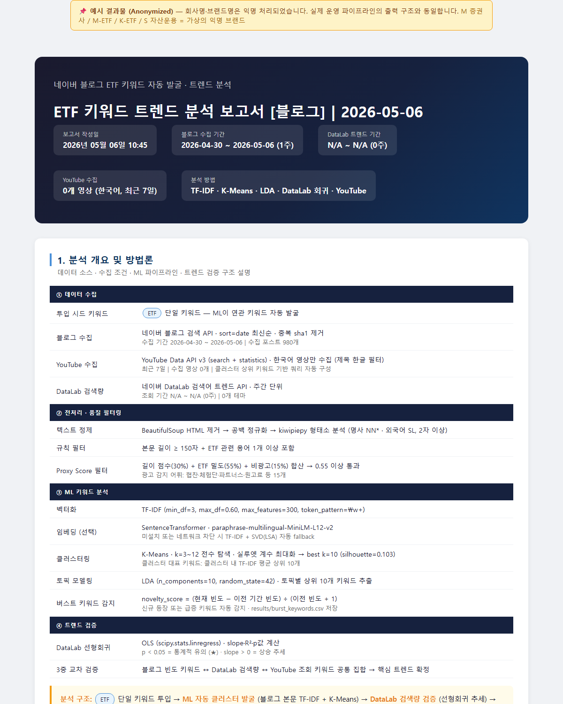
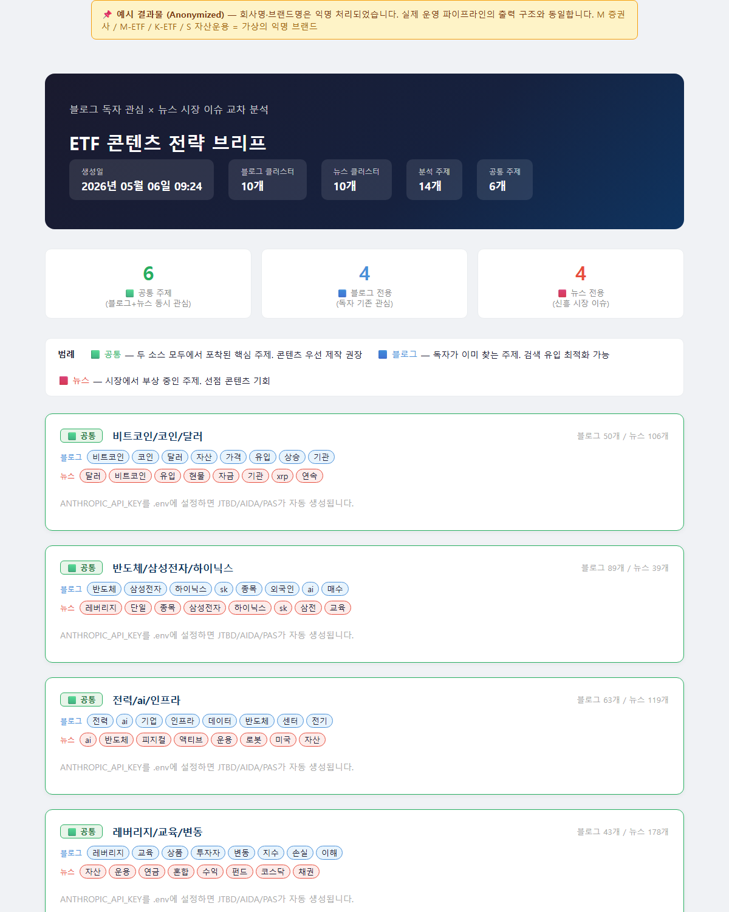
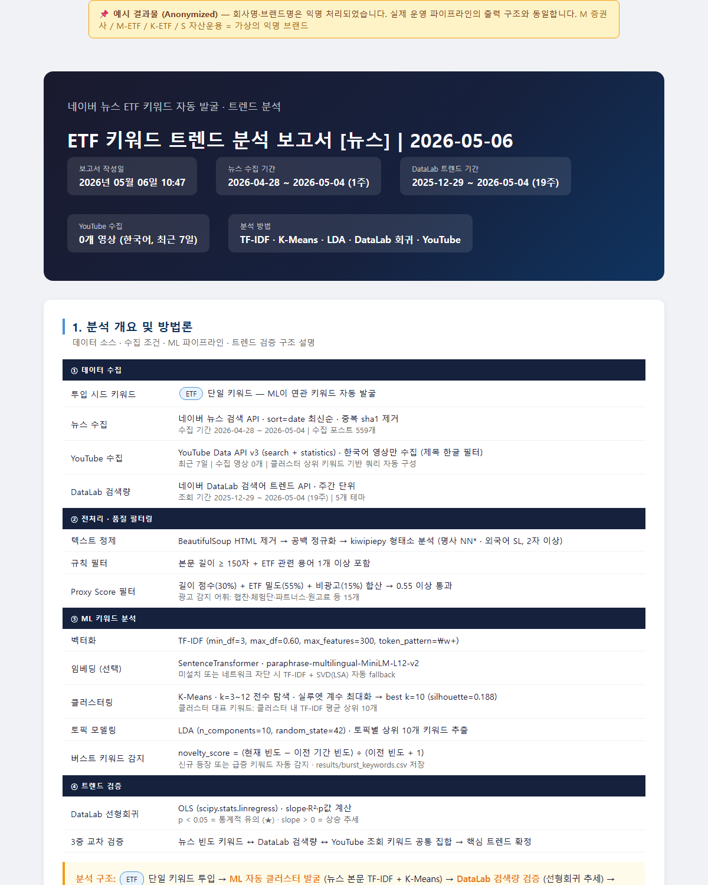
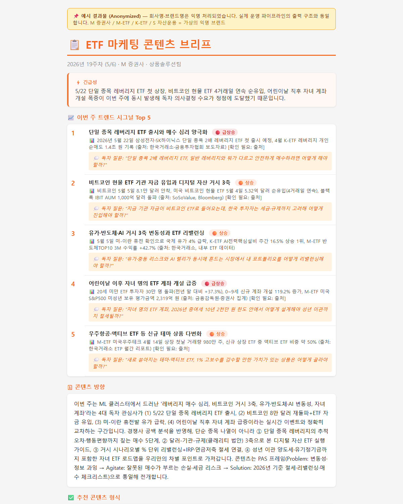
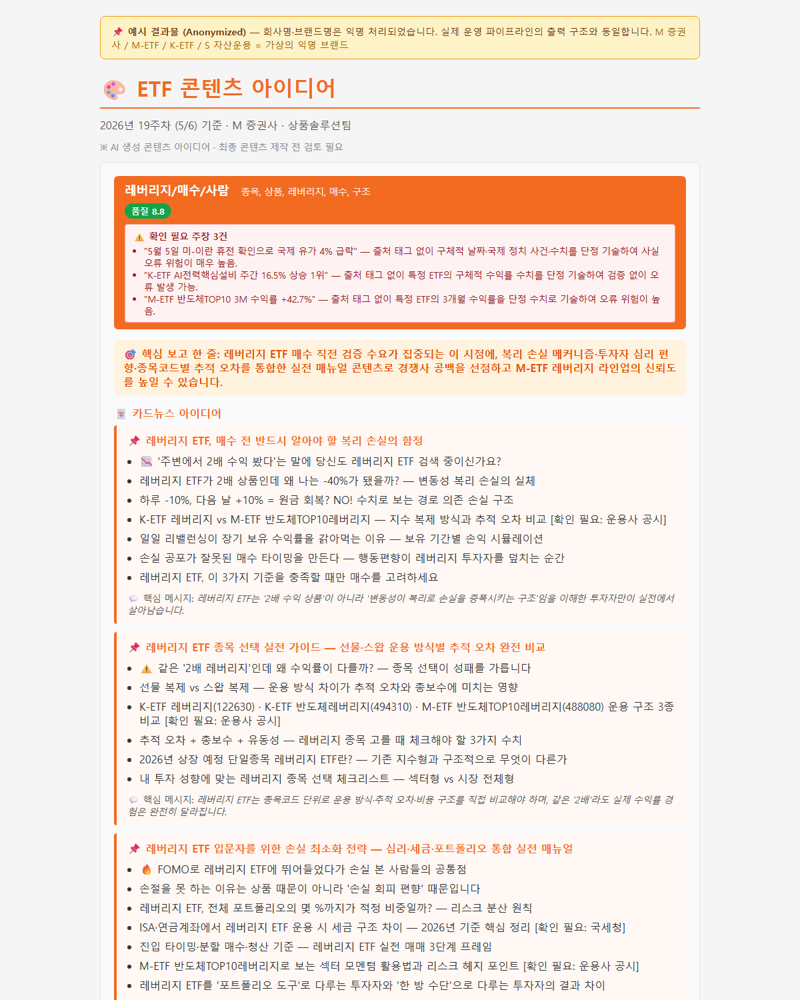

# Kuggle × LLM 멘토 세션 — 실습 노트북

> **건국대학교 응용통계학과 데이터사이언스 학회 Kuggle** 멘토 세션 (30분)
> 주제: **LLM 활용과 AI 자동화의 기초**


[](https://colab.research.google.com/github/cheon-si/kuggle-llm-session/blob/main/colab_practice.ipynb)

> ⬆️ 위 배지를 누르면 코랩이 바로 열립니다.
> 오른쪽 상단 **`Copy to Drive`** 를 눌러 본인 드라이브에 사본을 만들고 따라하세요.

---

## 🎯 5분 실습 흐름

| STEP | 내용 | 핵심 |
|------|------|------|
| 1 | 환경 세팅 (`pip install google-genai`) | Colab Secrets로 API Key 등록 |
| 2 | 첫 호출 — `generate_content()` 5줄 | LLM을 "함수"로 다루기 |
| 3 | 프롬프트 엔지니어링 — `system_instruction` 한 줄 | 페르소나 + Structured Output (JSON) |
| 4 | ML × LLM 결합 — 클러스터 자동 네이밍 | ETF 파이프라인 핵심 아이디어 재현 |

## 🔑 API Key 발급 가이드

### ✅ 권장: Google Gemini (카드 등록 없이 즉시 무료)
1. https://aistudio.google.com 접속 → Google 로그인
2. 좌측 `Get API key` → `Create API key` → 발급된 `AIza...` 복사
3. 코랩 좌측 사이드바 🔑 자물쇠 → `+ Add new secret`
   - Name: `GOOGLE_API_KEY`
   - Value: 복사한 키 붙여넣기
   - **Notebook access 토글 ON**

> 30분 세션 기준 — `gemini-2.5-flash` 모델은 무료 한도 안에서 충분히 실습 가능합니다.

### 부록: Anthropic Claude로 바꾸고 싶다면
1. https://console.anthropic.com 가입 → `API Keys` → `Create Key` (`sk-ant-...`)
2. 코랩 Secrets에 `ANTHROPIC_API_KEY` 로 저장
3. 노트북의 import / client / ask 함수만 아래로 교체 (나머지 동일):
   ```python
   # !pip install anthropic
   import anthropic
   client = anthropic.Anthropic()

   def ask(prompt, system="한 줄로 답하라.", temperature=0.2):
       r = client.messages.create(
           model="claude-sonnet-4-5",
           max_tokens=512,
           temperature=temperature,
           system=system,
           messages=[{"role": "user", "content": prompt}],
       )
       return r.content[0].text
   ```

> ⚠️ **API Key는 절대 노트북에 하드코딩하지 마세요.** GitHub에 그대로 올라가면 제3자가 본인 크레딧을 다 써버릴 수 있습니다. **반드시 Colab Secrets** 사용.

## 📂 레포 구조

```
.
├── README.md             # 이 파일
├── colab_practice.ipynb  # 30분 세션 실습 노트북
└── examples/             # 실제 파이프라인 결과물 (회사명·브랜드명 익명화)
    ├── 01_etf_trend_report_20260506.html   # 블로그 트렌드 리포트
    ├── 02_etf_content_brief.html           # 블로그×뉴스 교차 분석
    ├── 03_etf_trend_news_report_20260506.html  # 뉴스 트렌드 리포트
    ├── 04_content_brief_report.html        # LLM 트렌드 브리프 (Top 5)
    └── 05_content_ideas_report.html        # LLM 콘텐츠 아이디어
```

## 🖼 결과물 미리보기 (스크롤만 하면 보임)

> 📌 **회사명·브랜드명은 익명 처리되었습니다.**
> `M 증권사`, `M-ETF`, `K-ETF`, `S 자산운용` 은 모두 가상의 익명 브랜드이며, 실제 파이프라인이 만들어내는 출력 구조와 동일합니다.

### Step 4 — 블로그 트렌드 리포트



### Step 9 — 블로그 × 뉴스 교차 분석



### Step 4 (뉴스) — 뉴스 트렌드 리포트



### Step 10 — LLM 트렌드 브리프 (Top 5)



### Step 10 — LLM 콘텐츠 아이디어



---

### 🔎 원본 HTML로 보고 싶을 때

위 캡쳐는 페이지 상단만 잡힌 미리보기입니다. **전체 페이지를 스크롤하면서 보려면** 아래 링크 — 외부 프록시(`htmlpreview.github.io`)가 GitHub의 raw HTML을 브라우저에서 바로 렌더링해 줍니다.

| # | 결과물 | 원본 HTML 열기 |
|---|--------|----------------|
| 01 | 블로그 트렌드 리포트 | [열기 ↗](https://htmlpreview.github.io/?https://github.com/cheon-si/kuggle-llm-session/blob/main/examples/01_etf_trend_report_20260506.html) |
| 02 | 블로그 × 뉴스 교차 분석 | [열기 ↗](https://htmlpreview.github.io/?https://github.com/cheon-si/kuggle-llm-session/blob/main/examples/02_etf_content_brief.html) |
| 03 | 뉴스 트렌드 리포트 | [열기 ↗](https://htmlpreview.github.io/?https://github.com/cheon-si/kuggle-llm-session/blob/main/examples/03_etf_trend_news_report_20260506.html) |
| 04 | LLM 트렌드 브리프 (Top 5) | [열기 ↗](https://htmlpreview.github.io/?https://github.com/cheon-si/kuggle-llm-session/blob/main/examples/04_content_brief_report.html) |
| 05 | LLM 콘텐츠 아이디어 | [열기 ↗](https://htmlpreview.github.io/?https://github.com/cheon-si/kuggle-llm-session/blob/main/examples/05_content_ideas_report.html) |

## 🛠 직접 실행이 막힐 때

| 증상 | 해결 |
|------|------|
| `userdata.get` NameError | 코랩이 아닌 환경. 좌측 자물쇠 아이콘이 있는지 확인 |
| `PermissionDenied` / `API key not valid` | Secrets 이름 오타 (`GOOGLE_API_KEY` 정확히) / Notebook access OFF |
| `429 RESOURCE_EXHAUSTED` | 무료 분당 한도 초과. 잠시 대기하거나 `gemini-2.5-flash` → `gemini-2.5-flash-lite`로 변경 |
| `json.loads` 실패 | LLM이 JSON 외 텍스트를 추가로 뱉음. `system_instruction`에 "JSON 외 어떤 텍스트도 금지" 강조 또는 `response_mime_type="application/json"` 옵션 사용 |

## 📚 다음 단계

- **Anthropic Cookbook**: https://github.com/anthropics/anthropic-cookbook
- **Prompt Engineering Guide**: https://docs.anthropic.com/claude/docs/prompt-engineering
- **Vector DB / RAG 입문**: https://www.pinecone.io/learn/
- **실제 ETF 파이프라인 (멘토 베이스)**: 세션 슬라이드 Slide 13~17 참고

## 💬 멘토 컨택

`asq7659@gmail.com` — 진로 · 실무 · LLM/ML · 논문 등 무엇이든 환영합니다.

---

### LICENSE
이 노트북은 교육 목적의 예제입니다. 자유롭게 수정·재배포해도 좋습니다. (MIT)
